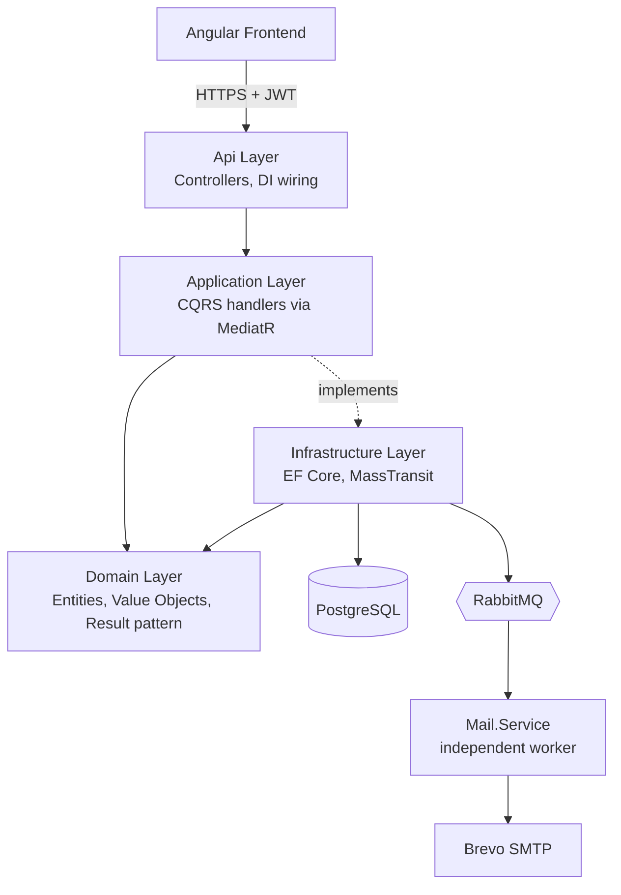
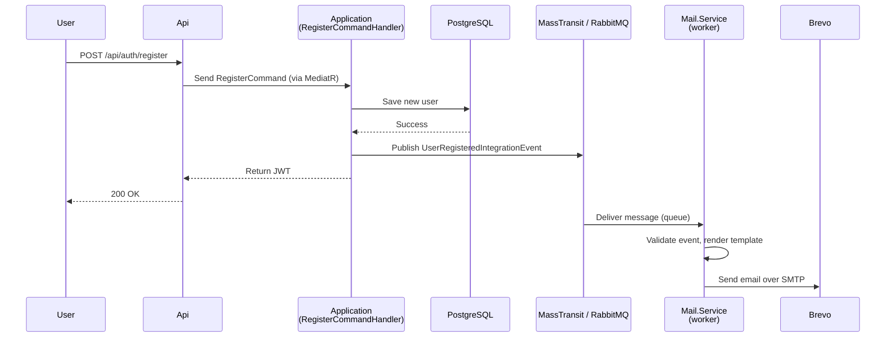

# WorkoutApp

A full-stack workout tracker built as a portfolio project for an internship application: Angular frontend, ASP.NET Core backend, demonstrating Clean Architecture with CQRS via MediatR, an event-driven integration with an independent mail service, and a containerized multi-service deployment.

Users register, log workouts, browse their history, and check a week-by-week breakdown of their training for any month they pick. Registration also triggers a real transactional email, delivered through a separate worker service rather than a mocked side effect.

## Table of Contents

- [Features](#features)
- [Architecture](#architecture)
- [Tech Stack](#tech-stack)
- [Project Structure](#project-structure)
- [Getting Started](#getting-started)
- [Local Development Setup](#local-development-setup)
- [Configuration](#configuration)
- [Deployment](#deployment)
- [API Documentation](#api-documentation)

## Features

- Registration and login with JWT authentication
- Log a workout: exercise type (cardio, strength, flexibility), duration, calories burned, a 1-10 difficulty rating, a 1-10 fatigue rating, optional notes, and the date and time it happened
- Workout history, newest first
- Monthly progress view: pick a month and see totals for each week in it (total duration, workout count, average difficulty, average fatigue); weeks run Monday to Sunday and are clipped to the month's boundaries, so a month starting mid-week shows a sensible partial first row instead of spilling into the previous month
- Profile page: edit name and email, or delete the account (soft delete, requires re-entering the password)
- Welcome email on registration, sent asynchronously so a slow or unreachable mail provider never fails the registration request itself

## Architecture

The backend follows Clean Architecture, split across projects with dependencies pointing strictly inward:



`Domain` has no dependency on EF Core, MassTransit, or ASP.NET Core at all. `Application` depends only on `Domain`. Those framework concerns live in `Infrastructure` and get wired together only at the composition root in `Api`. Every write goes through a CQRS command handler and every read through a query handler, both dispatched by MediatR.

### Event-driven registration email

Sending email synchronously inside the registration handler would couple account creation to SMTP availability and latency. Instead, `RegisterCommandHandler` publishes an integration event after the database commit succeeds, and a completely separate process picks it up:



If publishing to RabbitMQ fails (broker briefly unreachable), that's caught and logged rather than allowed to fail a registration that already succeeded in the database. The message is validated again on the consumer side before it's acted on, and MassTransit's retry policy plus RabbitMQ's dead-letter queue handle delivery failures without any custom retry code. `Mail.Service` can be deployed, redeployed, or scaled independently of the API since the only thing it shares with it is the message contract.

## Tech Stack

**Backend**
- .NET 10 / ASP.NET Core Web API
- Entity Framework Core + PostgreSQL (Npgsql)
- MediatR (CQRS)
- FluentValidation
- MassTransit + RabbitMQ (event bus)
- MailKit (SMTP delivery to Brevo)
- BCrypt.Net (password hashing)
- JWT Bearer authentication

**Frontend**
- Angular 22 (standalone components, signals, zoneless change detection)
- Reactive Forms

**Infrastructure**
- Docker, with a separate Dockerfile per service (Api, Mail.Service, frontend)
- nginx (serves the built Angular app and reverse-proxies API calls, so the browser only ever talks to a single origin)
- Docker Compose for local orchestration
- Brevo for transactional email delivery

## Project Structure

```
backend/
├── Api/src/
│   ├── WorkoutApp.Api             Controllers, auth wiring, composition root
│   ├── WorkoutApp.Application      CQRS commands/queries, DTOs, no framework deps
│   ├── WorkoutApp.Domain           Entities, value objects, repository interfaces
│   └── WorkoutApp.Infrastructure   EF Core, repositories, MassTransit
├── Mail.Service/src/
│   └── WorkoutApp.Mail.Service     Independent worker: consumes events, sends email
└── WorkoutApp.Contracts/           Integration event contracts, shared by Api and Mail.Service

frontend/                           Angular app

docker/
├── docker-compose.yml
└── .env                            not committed, see Configuration
```

## Getting Started

The entire stack runs via Docker Compose, no local .NET or Node installation needed just to run it.

**Prerequisites**: Docker Desktop, and a Brevo account with a verified sender if you want the welcome email to actually go out.

```bash
git clone <repo-url>
cd WorkoutApp/docker
# create .env, see Configuration below
docker compose up -d --build
```

Once running:
- Frontend: http://localhost:4200
- API (direct): http://localhost:5000
- RabbitMQ management: http://localhost:15672
- pgAdmin: http://localhost:5050

The API applies its own database migrations automatically on startup, no manual `dotnet ef database update` step needed. `mail-service` needs real `BREVO_*` values in `.env` to start; if they're left blank, that one container fails to start while everything else, including registration, still works fine, you just won't get the welcome email.

## Local Development Setup

Running the full stack in Docker is the fastest way to see it working, but for active development you'll want the Api, Mail.Service, and frontend running natively with hot reload and a debugger attached, while Postgres, RabbitMQ, and pgAdmin stay in Docker.

### Prerequisites

- [.NET 10 SDK](https://dotnet.microsoft.com/download)
- Node.js compatible with Angular 22's CLI, if `npm install` succeeds but `ng serve`/`npm start` fails with a Node version error, check `node -v` against what the CLI reports it needs
- Docker Desktop (for Postgres, RabbitMQ, pgAdmin)

### 1. Start the infrastructure containers

```bash
cd docker
docker compose up -d postgres rabbitmq pgadmin
```

`.env.example` already sets `COMPOSE_PROFILES=dev`, which is what gates pgAdmin, so copying it as-is to `.env` is enough. This exposes Postgres on `localhost:5432` and RabbitMQ on `localhost:5672`/`15672`. You still need `docker/.env`, see [Configuration](#configuration).

### 2. Configure user secrets

The Api and Mail.Service projects read local secrets via [.NET user secrets](https://learn.microsoft.com/en-us/aspnet/core/security/app-secrets), not `docker/.env` (that file only feeds the containerized build).

**Api** (from `backend/Api/src/WorkoutApp.Api`):
```bash
dotnet user-secrets set "Jwt:SecretKey" "<a long random string>"
dotnet user-secrets set "RabbitMq:Username" "<RABBITMQ_USER>"
dotnet user-secrets set "RabbitMq:Password" "<RABBITMQ_PASSWORD>"
```

**Mail.Service** (from `backend/Mail.Service/src/WorkoutApp.Mail.Service`), only needed if you want to run it:
```bash
dotnet user-secrets set "RabbitMq:Username" "<RABBITMQ_USER>"
dotnet user-secrets set "RabbitMq:Password" "<RABBITMQ_PASSWORD>"
dotnet user-secrets set "Brevo:Username" "<your Brevo SMTP login>"
dotnet user-secrets set "Brevo:ApiKey" "<your Brevo SMTP key>"
dotnet user-secrets set "Brevo:SenderEmail" "<the address you verified in Brevo>"
```

The RabbitMQ credentials must match whatever's in `docker/.env`, since both point at the same container. There's no local mail-catcher fallback here, if you don't set real Brevo credentials, just don't run Mail.Service, registration still works without it.

### 3. Trust the HTTPS dev certificate

The Api runs on `https://localhost:7193` locally. If the dev certificate isn't trusted, frontend requests fail with a network error that browsers often mislabel as a CORS error:
```bash
dotnet dev-certs https --trust
```

### 4. Run the backend

In separate terminals:
```bash
cd backend/Api/src/WorkoutApp.Api
dotnet run
```
→ `https://localhost:7193`, Swagger at `/swagger`. Migrations apply automatically on startup.

```bash
cd backend/Mail.Service/src/WorkoutApp.Mail.Service
dotnet run
```

### 5. Run the frontend

```bash
cd frontend
npm install
npm start
```
→ `http://localhost:4200`, matching the Api's hardcoded CORS origin and the `apiUrl` already set in `environment.development.ts`.

### Troubleshooting

- **"CORS request did not succeed" calling the Api from the browser**: almost always the untrusted HTTPS dev cert (step 3), not an actual CORS misconfiguration. The allowed origin itself is hardcoded to `http://localhost:4200` in `AddApiServices`, not configurable, so running the frontend on a different port will genuinely fail CORS.
- **`npm start` fails with a Node version error**: Angular's CLI enforces its Node requirement at runtime, not just as an `engines` warning.
- **Mail.Service exits immediately on startup**: check that all required `Brevo:*` and `RabbitMq:*` user secrets are set, they're validated on startup and the process won't come up without them.

## Configuration

Create `docker/.env` from `docker/.env.example` and fill in real values:
```
POSTGRES_USER=workoutapp
POSTGRES_PASSWORD=changeme
POSTGRES_DB=workoutapp
POSTGRES_PORT=5432
PGADMIN_DEFAULT_EMAIL=admin@workoutapp.com
PGADMIN_DEFAULT_PASSWORD=changeme
PGADMIN_PORT=5050
RABBITMQ_USER=workoutapp
RABBITMQ_PASSWORD=changeme
RABBITMQ_PORT=5672
RABBITMQ_MANAGEMENT_PORT=15672
BREVO_USERNAME=<your Brevo SMTP login>
BREVO_API_KEY=<your Brevo SMTP key>
BREVO_SENDER_EMAIL=<a sender address verified in Brevo>
JWT_SECRET_KEY=<a long random string>
API_PORT=5000
FRONTEND_PORT=4200
COMPOSE_PROFILES=dev
```

`.env` is git-ignored, nothing above is committed to the repo.

## Deployment

Deployed to an Ubuntu VM on Azure, running the same Docker Compose stack as local dev minus the dev-only tools (pgAdmin), with internal services like Postgres and RabbitMQ bound to `127.0.0.1` on the VM so only the frontend and API are actually reachable from outside. A GitHub Actions workflow builds the project on every push and deploys over SSH, so a broken commit gets caught in CI before it reaches the VM.

The VM is currently stopped to avoid ongoing cloud costs between demos. Everything needed to bring it back up (Docker Compose config, the GitHub Actions deploy workflow) is already in the repo, it's a redeploy rather than a rebuild.

## API Documentation

Swagger UI is available at `/swagger` when the API runs in `Development` mode, disabled in the containerized production build, consistent with not exposing API docs on a public deployment by default.
